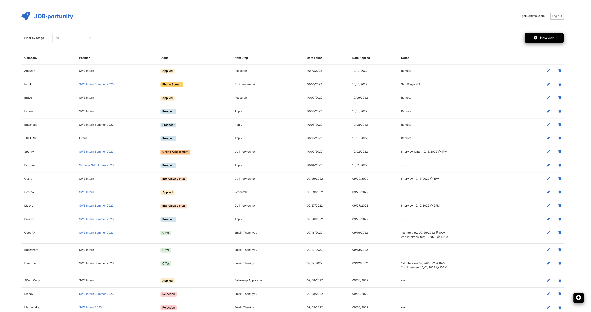

 

  <h1 align="center">Jobportunity</h1>

## About The Project

Jobportunity is a web application that helps you manage your job search all in one place and keep track of all your job applications and progress.

I wanted to build this tool not only to organize my internship search more easily, but to gain some experience working with the MERN stack as well. 

(<a href="#readme-top">back to top</a>)

### Frontend/Client
  * built with ReactJS and Bootstrap
  * single page that displays a table of data that is fetched from MongoDB Atlas

### Backend/Server
  * driven by NodeJS utilizing Express to route and perform CRUD operations on MongoDB Atlas
  * protected using JSON Web Tokens

(<a href="#readme-top">back to top</a>)

